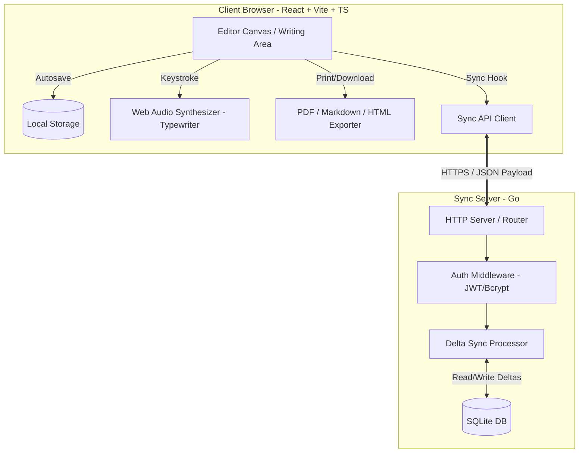

# Minimal Write Ecosystem

A modern, distraction-free writing application inspired by [blank.page](https://blank.page/) but enhanced with premium, local-first, privacy-focused features, and clean architecture.

## 🌟 Core Philosophy & Features

- **Distraction-Free Workspace**: Generous whitespace, clean typography, and UI chrome that fades away completely as you type.
- **Offline-First / Local-First**: Your writing is instantly saved to `localStorage` and fully functional offline.
- **Optional Cloud Sync**: Toggleable secure backup and delta sync to a private Go backend with user accounts (secured by JWT and bcrypt).
- **Typewriter Sounds**: Immersive typing experience with mechanical key click and carriage return bell sounds synthesized dynamically via the Web Audio API (zero audio file assets required).
- **Publishing & Sharing**: Generate read-only public sharing links. The frontend automatically enters a reader-friendly layout for shared documents.
- **Rich Customizations**: Custom font families (Serif, Sans, Mono), sizes, spacing, page widths, writing targets (with goal progress bar), and toggleable native spell check.
- **Export Formats**: Seamlessly download or export your work to **Markdown (.md)**, **Plain Text (.txt)**, **HTML (.html)**, or **Print/PDF**.
- **Keyboard Shortcuts**: Complete control at your fingertips.

---

## 🏗️ System Architecture



### Sync & Conflict Resolution Flow
1. The client maintains an `updated_at` millisecond timestamp for each document.
2. When performing a Sync, the client sends its list of documents and its `last_sync_time`.
3. The server checks the SQLite database:
   - If a document is new, it inserts it.
   - If a document exists, it compares timestamps: if client `updated_at >` server `updated_at`, the server record is updated (Last-Write-Wins).
4. The server returns all records matching `updated_at > last_sync_time` for that user.
5. The client merges these updates, handling soft-deletes (tombstones).

---

## 🚀 Quick Start (Docker Compose)

The easiest way to spin up the entire ecosystem (both frontend and backend) is using Docker Compose:

```bash
docker-compose up --build
```

- **Frontend UI**: Open [http://localhost:80](http://localhost:80)
- **Backend API**: Running on [http://localhost:8080](http://localhost:8080)
- **SQLite Database**: Saved in a persistent named volume `backend-data`.

---

## 🛠️ Manual Development Setup

If you prefer to run the components locally without Docker:

### Prerequisites
- [Go 1.21+](https://go.dev/dl/)
- [Node.js 18+](https://nodejs.org/)

### 1. Run the Backend Sync Service
```bash
cd backend
# Install dependencies
go mod tidy
# Run the database migrations and server
go run .
```
The server will start on port `8080` and create a database file `minimal_write.db` in the `backend` directory.

### 2. Run the Frontend App
```bash
cd frontend
# Install packages
npm install
# Run the development server
npm run dev
```
Open [http://localhost:5173](http://localhost:5173) in your browser.

---

## ⌨️ Keyboard Shortcuts

| Shortcut | Description |
|---|---|
| `Ctrl + N` | New Blank Document |
| `Ctrl + O` | Open Local File Picker |
| `Ctrl + S` | Download Markdown (.md) |
| `Ctrl + P` | Toggle Live Markdown Split Preview |
| `Ctrl + Shift + F` | Toggle Browser Fullscreen |
| `Ctrl + Shift + D` | Toggle Dark / Light Theme |

Formatting helpers (Textarea selection):
- Select text and click the bottom formatting buttons to wrap text with Markdown tokens (`**` for bold, `*` for italics, `#` for headers, etc.)

---

## 🤝 Contribution Guide

1. **Commit Strategy**: We prefer small, atomic, logical commits. Use `git add -p` to stage specific hunks.
2. **Formatting**:
   - Go: Run `go fmt ./...` and `golangci-lint run`.
   - Frontend: Code compiles strictly in TypeScript strict mode. Prettier/ESLint rules apply.
3. **Tests**: Add unit tests for critical Go handlers or React utility hooks.

---

## 📄 License

This project is licensed under the [MIT License](LICENSE).
