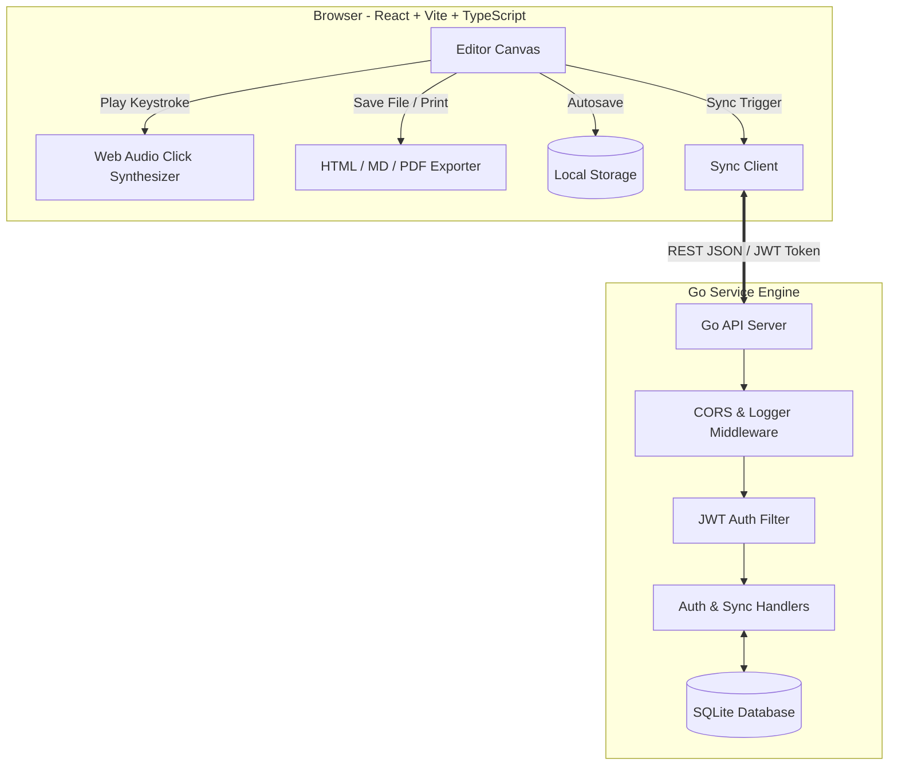

# 📝 Minimal Write Ecosystem
> **A premium, local-first, distraction-free writing environment.** Inspired by the simplicity of `blank.page` but engineered with a modern Go sync backend, dynamic audio synthesis, GitHub-style Markdown rendering, and strict privacy controls.

---

## 🔍 What is Minimal Write? (Problem & Solution)

Traditional writing apps are bloated with formatting tools, cluttered sidebars, telemetry trackers, and forced cloud dependencies that break when offline. 

**Minimal Write fixes these friction points:**
- **Zero Distractions**: The user interface (menus, toolbar, sidebars) fades away entirely as you type, leaving only your text.
- **Privacy & Local-First**: Your data is yours. It is stored on-device in `localStorage` by default. There is no telemetry, tracking, or unsolicited cookies.
- **Offline Reliability**: Write anywhere, with or without internet. When you connect, updates sync seamlessly.
- **Secure Cloud Backup**: Opt-in delta sync backup to a private Go server.
- **Immersive Writing**: Typewriter audio synthesis provides tactile feedback, helping you find your creative flow.

---

## 🎨 Layout Preview & Layout Modes

Minimal Write adapts to your style, monitor, and writing preferences:

| Layout Mode | Description | Visual Focus |
|---|---|---|
| **Editor Canvas** | Pure distraction-free blank sheet. UI fades during typing. | Absolute focus on content |
| **Split Preview** | Side-by-side editing and live rendered HTML preview. | Content structure & layouts |
| **Preview Only** | Read-only mode showing the document compiled as structured HTML. | Document reading/review |
| **Zen Mode** | Centered writing canvas. All headers, sidebars, and word counts are hidden. | Ultimate single-pane focus |
| **Shared Reader** | Public link layout. Clean, reader-friendly typography. | Sharing articles and notes |

---

## 🚀 0 to 100 Quick Start (Running Locally)

You can spin up the complete ecosystem (both frontend and backend) in less than a minute.

### Option A: The Docker Compose Way (Recommended)
This compiles the Go binary, builds the React assets, and serves them via an optimized Nginx server.

```bash
# 1. Start the containers
docker-compose up --build -d

# 2. Check that everything is running
docker-compose ps
```

- **Web UI Client**: Open [http://localhost:80](http://localhost:80)
- **Go API Engine**: Access endpoints at [http://localhost:8080/api](http://localhost:8080/api)
- **Persistent Data**: SQLite database is stored in the Docker volume `backend-data`.

---

### Option B: The Manual Way (Developer Mode)

#### Prerequisites
- [Go 1.21+](https://go.dev/dl/)
- [Node.js 20+](https://nodejs.org/)

#### Step 1: Run the Go Backend Sync Service
```bash
cd backend

# Fetch and cache dependencies
go mod tidy

# Run migrations and start the server
go run .
```
> [!NOTE]
> The server listens on port `8080` by default and initializes a local database file `minimal_write.db` in the `/backend` folder.

#### Step 2: Run the Frontend React Application
```bash
cd frontend

# Install package dependencies
npm install

# Start the Vite development server
npm run dev
```
- Open your browser to [http://localhost:5173](http://localhost:5173).
- Toggle settings, type text, turn on typewriter sounds, and connect to sync!

---

## 📖 Developer Wiki & System Architecture

### System Flow Diagram


### Database Schema (SQLite)

The backend uses a lightweight SQLite schema optimized with indexes for query speeds.

#### 1. `users` Table
Stores credentials for secure delta sync authentication.
```sql
CREATE TABLE IF NOT EXISTS users (
    id INTEGER PRIMARY KEY AUTOINCREMENT,
    username TEXT UNIQUE NOT NULL,
    password_hash TEXT NOT NULL,
    created_at INTEGER NOT NULL
);
```

#### 2. `documents` Table
Stores user documents with soft-delete tombstones for multi-device sync integrity.
```sql
CREATE TABLE IF NOT EXISTS documents (
    id TEXT PRIMARY KEY,
    user_id INTEGER NOT NULL,
    title TEXT NOT NULL,
    content TEXT NOT NULL,
    updated_at INTEGER NOT NULL,
    created_at INTEGER NOT NULL,
    is_deleted INTEGER DEFAULT 0,
    share_id TEXT UNIQUE,
    FOREIGN KEY (user_id) REFERENCES users(id) ON DELETE CASCADE
);
```

### Delta Sync & Conflict Resolution Algorithm

Minimal Write uses a client-side **Last-Write-Wins (LWW)** conflict resolution algorithm:

1. **Timestamps**: Each document contains an `updated_at` millisecond Unix timestamp.
2. **Client Push**: When a client triggers a sync, it POSTs its array of modified documents along with a `last_sync_time` parameter.
3. **Server Merge**:
   - If the server has no record for the document ID, it inserts the document.
   - If the server has a record, it compares timestamps:
     - If `client.updated_at > server.updated_at`, the server's record is overwritten.
     - If `client.updated_at <= server.updated_at`, the server's record is preserved.
4. **Server Pull**: The server queries the database for all records belonging to the authenticated user where `updated_at > client_last_sync_time`.
5. **Tombstoning**: Deleting a file toggles `is_deleted = 1` and bumps `updated_at`. When synced, the server records the deletion, and other clients purge the file on their next sync cycle.

---

## 📡 API Reference Manual

All request and response payloads communicate using standard JSON. Protected endpoints require a `Bearer <JWT_TOKEN>` header.

### 🔐 Authentication Endpoints

#### 1. User Signup
- **URL**: `/api/auth/signup`
- **Method**: `POST`
- **Payload**:
  ```json
  {
    "username": "writer1",
    "password": "securepassword123"
  }
  ```
- **Response (200 OK)**:
  ```json
  {
    "token": "eyJhbGciOiJIUzI1NiIsIn...",
    "user": { "id": 1, "username": "writer1" }
  }
  ```

#### 2. User Login
- **URL**: `/api/auth/login`
- **Method**: `POST`
- **Payload**: Same as Signup.
- **Response (200 OK)**: Same as Signup.

---

### 🔄 Document Sync Endpoints (Protected)

#### 1. Push & Pull Document Deltas
- **URL**: `/api/sync?last_sync_time=1719948000000`
- **Method**: `POST`
- **Payload**:
  ```json
  {
    "documents": [
      {
        "id": "uuid-1234-5678",
        "title": "My Novel",
        "content": "Once upon a time...",
        "updated_at": 1720000000000,
        "created_at": 1720000000000,
        "is_deleted": false
      }
    ]
  }
  ```
- **Response (200 OK)**:
  ```json
  {
    "updates": [
      {
        "id": "uuid-9999-0000",
        "title": "Poetry Collection",
        "content": "Roses are red...",
        "updated_at": 1720000100000,
        "created_at": 1720000100000,
        "is_deleted": false,
        "share_id": ""
      }
    ],
    "server_time": 1720000200000
  }
  ```

---

### 🔗 Public Sharing Endpoints

#### 1. Toggle Public Share Status (Protected)
- **URL**: `/api/share`
- **Method**: `POST`
- **Payload**:
  ```json
  {
    "document_id": "uuid-1234-5678",
    "share": true
  }
  ```
- **Response (200 OK)**:
  ```json
  {
    "share_id": "abcde12345fghij"
  }
  ```

#### 2. View Shared Document (Public)
- **URL**: `/api/shared?share_id=abcde12345fghij`
- **Method**: `GET`
- **Response (200 OK)**:
  ```json
  {
    "id": "uuid-1234-5678",
    "title": "My Novel",
    "content": "Once upon a time...",
    "updated_at": 1720000000000,
    "created_at": 1720000000000
  }
  ```

---

## ⌨️ Cheat Sheets & Usage Guides

### Global Keyboard Shortcuts
Press these hotkeys inside the editor canvas to trigger panel toggles and styling commands:

| Hotkey | Action | Notes |
|---|---|---|
| `Ctrl + N` | New Blank Document | Prompts to clear canvas |
| `Ctrl + O` | Open Local Document | Loads `.md`, `.txt`, `.html` |
| `Ctrl + S` | Download Markdown | Exposes offline download |
| `Ctrl + P` | Toggle Live Preview | Switches layout views |
| `Ctrl + Shift + F` | Toggle Fullscreen | Locks browser window |
| `Ctrl + Shift + D` | Toggle Dark/Light Mode | Smooth transitions |
| `Ctrl + Shift + T` | Toggle Formatting Toolbar | Hide/show toolbar |
| `Ctrl + Shift + W` | Toggle Word Count | Hide/show count footer |
| `Ctrl + Shift + Z` | Toggle Zen Focus Mode | Hides all page elements |
| `Ctrl + Shift + S` | Toggle Settings Sidebar | Opens styling options drawer |
| `Ctrl + Shift + Y` | Toggle Cloud Sync Modal | Connects sync profile |

---

### 📝 Sample Markdown Template
Copy and paste this markdown text block into the editor canvas to check the **GitHub-style** layout rendering:

```markdown
# Header 1 (Title)
## Header 2 (Subtitle)

This is a paragraph featuring **bold text**, *italic emphasis*, and ~~strikethrough text~~.

### Blockquotes
> "Writing is an exploration. You start from nothing and learn as you go."
> — E.L. Doctorow

### Code Highlights
You can write inline code like `const active = true;` or create multiline code blocks:

```javascript
function greet(user) {
  console.log(`Hello, ${user}!`);
}
greet("Writer");
```

### Table Rendering
| Feature | Local | Cloud |
|---|:---:|:---:|
| Autosave | ✅ | ✅ |
| Typewriter Sounds | ✅ | N/A |
| Delta Sync | ❌ | ✅ |
```

---

## 🧪 Tests & Quality Assurance

### Go Backend Integration Tests
Tests are executed on an in-memory SQLite database instance. They verify registration, password hash comparison, duplicates rejection, and access tokens.

```bash
cd backend
go test -v ./...
```

Expected output:
```text
=== RUN   TestSignupAndLoginFlow
--- PASS: TestSignupAndLoginFlow (0.73s)
PASS
ok  	backend	0.736s
```

### Frontend Typechecking & Bundling
Runs TypeScript compilation and Vite bundler to test production builds:

```bash
cd frontend
npm run build
```

---

## 🤝 Contribution Guidelines

1. **Commit Convention**: Commit frequently with clear, descriptive, and atomic messages.
2. **Formatting Standards**:
   - Go: run `go fmt ./...` before committing.
   - Frontend: Code must pass strictly in TypeScript strict mode. Run `npm run build` to verify bundles.
3. **Testing**: When editing handlers, update `backend/main_test.go` to maintain 100% test pass.
